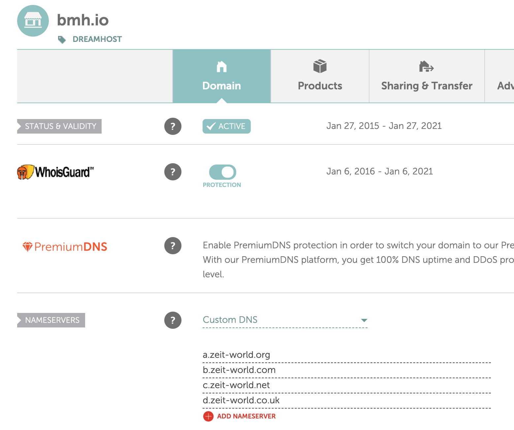

My previous "blog" was "written" with [Hugo](https://gohugo.io/) and hosted on [Netlify](https://netlify.com). I use quotes because for the last two years it had no content at all so it wasn't much of anything. Today I was chatting at work with some folks about what blog platforms we use and I wanted to not feel like such a poser.

<!-- more -->

That preface out of the way, I've decided that a new year means a new blog and I'm resolving to write weekly about my various adventures and thoughts revolving around technology here. Hopefully 2020 is a better year in oh so many ways. "What is this new blog written in?" you ask. It's [Hexo](https://hexo.io/) and it is running on [Zeit Now](https://zeit.co/).

Why did I chose those two? Despite my firey hate of all things JavaScript, it is a useful language to learn, the community around [Hexo](https://hexo.io) seems much more vibrant, and it's stupidly easy to use. As for my decision to use Zeit, it seems like if I want to jump into any squirrely experiments with different cloud platforms and serverless functions, Zeit is much more flexible than Netlify while still retaining the simple Github-based workflow that I like.

Given how much easier it should be to maintain and update this blog, I'm hoping it will be easy to keep that resolution to write here biweekly. 🤞

## How I set this up on OSX

1. Delete old empty blog [commit](https://github.com/highb/bmh/commit/90f6834efa0fc420e53130821eaf573ecd37183e)

  ```bash
  # nuke everything, boring git stuff
  git rm -rf *
  git commit -m 'Dump netlify and hugo'
  git push origin master
  ```

1. Install [NodeJS](https://nodejs.org/en/) and [hexo](https://hexo.io/docs/)

  ```bash
  brew install nodejs # could also download the pkg or YOLO curl | bash
  npm install hexo -g
  ```

1. Use `hexo init` to make a new blog from the default template

  Since I already had a git repo checked out, I had to use `hexo init` in a subdirectory and move it out.

  ```bash
  hexo init blog
  mv blog/* .
  ```

1. Fiddle with `_config.yml` [commit](https://github.com/highb/bmh/commit/a3d2203eb05912f45ee3ac8b3ef70fecec56caba)

  Yet another YAML file in my life. Browsed through it and fiddled with settings like `title`, `url`, etc.

1. Make the beginnings of this blog post [commit](https://github.com/highb/bmh/commit/9fb256f08875a0b829333670d19f810698e08c6a)

  Created a new file `source/_posts/New-Year-New-Blog.md` by calling `hexo new 'New Year New Blog'`. Filled it out with some pretty standard [Markdown](https://www.markdownguide.org/) content.

1. Add a theme and fiddle with it's settings [commit](https://github.com/highb/bmh/commit/51c7589f4c4d11fb4902d374a9c1ec99d33249a8)

  I was originally going to use `git submodule` to checkout my [fork](https://github.com/highb/hexo-theme-next) of the [theme](https://theme-next.org/) I found but then I remembered that submodules are terrible so I used `git rebase -i` to pave over that chapter of history, replaced it with a literal copy of my local checkout of my fork (minus the `.git` folder) and force pushed `git push origin master -f` over the evidence. 🔥📁🔥 I'll just pull down from `upstream` on my fork and copy over the files whenever I want to update or make changes. 

  In Hugo, themes can also have settings. So I fiddled around with those a bit. 🤷‍♂️ I just have to remember to copy the `_config.yml` hacking I did back over to my fork of the theme.

1. Make this blog post :inceptiontop: [commit](https://github.com/highb/bmh/commit/f37e3ea5072dececea4080b7a5191ae9d7654e39)

  Checked out what it will look like locally with `hexo server`.

1. Login to Zeit create a new project

  I created [a new project](https://zeit.co/new), filled it out with the details for my blog and linked it to my [Github repo](https://github.com/highb/bmh). I restricted the permissions to the small set of static sites that I deploy and not include the hundreds of work forks. It's pretty easy to update them again later, if you search for a repo but Zeit can't find the repo, Zeit offers a link to the [app config on Github](https://github.com/settings/installations/5601560).

  Once the repo was added, Zeit immediately began build it (I think it uses npm actions in `package.json`) and then deployed it to a temporary domain.

1. Setup Zeit domain

  I didn't want to have to deal with [NameCheap](https://namecheap.com) *and* [CloudFlare](https://cloudflare.com) for this silly blog, so I ported DNS management over to Zeit on NameCheap. For some reason the bulk edit didn't like the single character subdomains on Zeit (for example, `a.zeit-world.org`) but the "Manage" screen was fine with it. 🤷‍♂️ Sounds like a fun bug for someone that isn't me to fix. DNS migrated super-quick and easy.

  

  I decided I wanted to add a screenshot, which required adding [`hexo-asset-link`](https://github.com/liolok/hexo-asset-link) via `npm i --save hexo-asset-link`.

That's about it. Hopefully you've learned something from this overly verbose guide. 😅 Hello to all the crawlers and bots out there!
